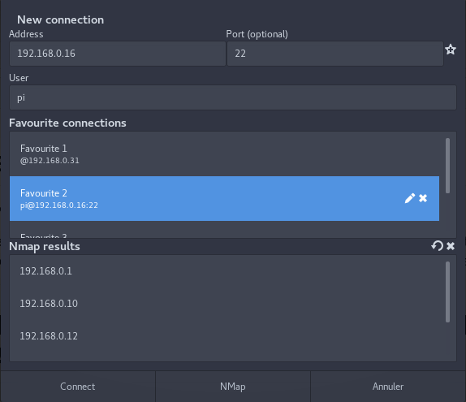

# gnome-shell-extension-isshu
Extension for a Putty-like tool in Gnome-Shell, for SSH connections.

### DESCRIPTION

The tool opens a SSH session in the terminal, based on a username and SSH destinaion (address + port).
The tool can manage favourite connections and save the latest connections (see the ~/.isshu folder automatically generated).
The tool also runs Nmap, to scan the local network, and see the available hosts on the network.
The user can choose which terminal to use.

### SCREENSHOT

# IF SOMEONE HAS A GOOD IDEA FOR A LOGO, PLEASE SEND ME A PROPOSITION